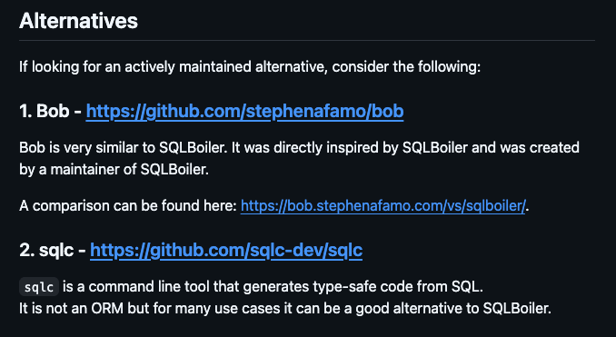

## はじめに
最近業務でGo周りの技術選定をするタイミングがあり、DBアクセスライブラリを調べている中で今まで知らなかった「[Bob](https://github.com/stephenafamo/bob)」というライブラリに出会い、検証をして、他の有名なライブラリとの比較を行いました。本記事ではBobの紹介と、他ライブラリ(GORMとsqlc)との比較、Bobの良いところをメインに紹介しつつ、制約みたいな部分にも触れていこうかなと思います！！！

## GoにおけるDBアクセスの種類
まず、ライブラリにおけるDBアクセスは様々な方式が存在します。Go（他の言語でも大差ないと思いますが）では大きく分けて以下のような種類があるかと思います。

| 書き方                     | 分類                   | 代表例              |
| -------------------------- | ---------------------- | ------------------- |
| 生SQLを書く                | 標準ライブラリ         | `database/sql`, pgx |
| 生SQL + 構造体マッピング   | `database/sql`のラッパ | sqlx                |
| SQLからGoコード生成        | SQL First              | sqlc                |
| スキーマからビルダーを生成 | 型安全なSQLビルダー    | jet, Bob            |
| 構造体からSQLを発行        | ORM（Code First）      | GORM, Bun           |
| DBスキーマからモデル生成   | ORM（DB First）        | SQLBoiler, Bob      |
| Goでスキーマを定義         | ORM（Schema as Code）  | ent                 |

### 各ツールの困りごと
どの方式にも一長一短がありますが、ここでは利用者の多いGORMとsqlcを例に、実際に書いていて引っかかりやすいところを見ていきます。以降のコード例は、次のような`users`テーブルを前提にしています。

```sql
CREATE TABLE users (
    id BIGINT GENERATED ALWAYS AS IDENTITY PRIMARY KEY,
    name TEXT NOT NULL,
    active BOOLEAN NOT NULL DEFAULT TRUE,
    role TEXT NOT NULL DEFAULT 'member',
    nickname TEXT
);
```

#### GORMのここがよわ〜〜〜い
GORMはGoの構造体をモデルとして定義し、そこからSQLを発行するORMです。

```go
type User struct {
    ID       int64
    Name     string
    Active   bool
    Role     string
    Nickname *string
}
```

##### 1. フィールドのTypoがコンパイル通ること {#gorm-typo}
GORMで条件を書くときは、`Where`に列名を文字列で渡すのが基本です。

```go
var users []User
// active を actvie と誤記している
err := db.Where("actvie = ?", true).Find(&users).Error
```

`"actvie = ?"`はGoから見ればただの文字列なので、コンパイルは通ります。誤りに気づけるのはクエリを実行してDBがエラーを返したときです。列名をリネームしたときも同様で、文字列で書いた条件の修正漏れはテストや実行時まで見つかりません。

##### 2. ゼロ値での更新がめんどくさい {#gorm-zero-value}
もう一つ引っかかりやすいのが更新です。`Updates`に構造体を渡すと、GORMは**ゼロ値のフィールドを更新対象から除外**します。

```go
// Active を false にしたいが、false はゼロ値なので UPDATE に含まれない
err := db.Model(&user).
    Updates(User{Active: false}).Error
```

`bool`の`false`、`string`の`""`、`int`の`0`はいずれもゼロ値なので、「値を指定していない」のか「その値で更新したい」のかを構造体だけでは区別できません。これはGORMの仕様で、以下の2つの方法でこの問題を回避できます。

1. `Select`で更新する列を明示する
2. `map`を渡せば回避する

```go
// 更新する列を明示する
err = db.Model(&user).
    Select("Active").
    Updates(User{Active: false}).Error

// map で渡す
err = db.Model(&user).
    Updates(map[string]any{"active": false}).Error
```

ただ、回避策の`Select("Active")`も`map`のキーも文字列です。結局、型の恩恵を受けられない書き方に戻ってしまいます。

なお、GORMにも[GORM Gen](https://gorm.io/gen/query.html)や[Generics API](https://gorm.io/docs/the_generics_way.html)のような型付きの選択肢はあります。ここで挙げているのはあくまで基本的な文字列条件・構造体更新を使った場合の困りごとです。

#### sqlcのここがよわ〜〜〜〜〜い {#sqlc-dynamic}

sqlcは生SQLを書いて、それらを実行する型付きのGo関数を自動生成するツールです！AI時代で、SQLを一から書くハードルがグッと下がって、個人的にはSQLによって何をやっているのかわかりやすい上に、Goの型で守られておりとても好きなライブラリです。

困りやすいのは、**画面の入力に応じて検索条件が変わる**場面です。たとえば次のようなユーザー検索APIを考えます。

- `role`が指定されたときだけ絞り込む
- `active`は「未指定 / true / false」の3通り

sqlcはクエリごとに関数を生成する仕組みなので、Go側で条件を後から足すことはできません。条件の有無はSQLの中で表現することになります。よく使われるのが`sqlc.narg`（NULL可能なパラメータ）で、「NULLなら条件を無効にする」という書き方です。

```sql
-- name: SearchUsers :many
SELECT id, name, active, role
FROM users
WHERE
  (sqlc.narg('role') IS NULL
   OR role = sqlc.narg('role'))
AND
  (sqlc.narg('active') IS NULL
   OR active = sqlc.narg('active'));
```

条件が2つ程度ならこれで十分ですが、条件が増えるたびに`IS NULL OR ...`がSQLに積み重なっていきます。さらに並び順やJOINまで入力で切り替えたくなると、SQL側で`CASE`を使うか、用途ごとにクエリを分けるかを考える必要が出てきます。

GORMは**列名と更新内容が型で守られにくい**、sqlcは**型安全だが動的な条件をGo側で組み立てにくい**、というのがそれぞれの困りごとです。

## Bobについて
### Bobの前身について
まずBobを見つけるきっかけとなったのは、上の表にもある通り、DB First系で一番有名だったコード生成ツールである`SQLBoiler`です。

この`SQLBoiler`が2024年末ごろにメンテナンスモードに入り、そのメンテナたちによって新しく作成されているプロジェクトが`Bob`です。

実際に、`SQLBoiler`のREADMEを見ると、Alternatives(代替案)としてBobが紹介されています。


### Bobとは？
Bobは、Go向けのSQLクエリビルダーとコード生成ツールです。`SQLBoiler`の後継なので、DBスキーマを読み取って型安全なモデルを生成できます。それに加えて、次の3つの使い方ができます。

| 使い方         | 何を書くか                                     | 向いている場面                            |
| -------------- | ---------------------------------------------- | ----------------------------------------- |
| クエリビルダー | GoでSQLの句（SELECT / WHERE など）を組み立てる | 動的な検索、複雑なSQL                     |
| 生成モデル     | DBスキーマから生成した型を使う                 | CRUD、列や値の型チェック                  |
| SQLからの生成  | 手書きSQLをGoの関数にする                      | SQLを先に書きつつ、あとから条件も足したい |

特に面白いのは、**生成した型を使ったまま、Go側で条件を足せる**ところです。DBスキーマから生成した型で条件を書けるのでGORMの文字列条件のような誤記はコンパイル時に分かり、sqlcのようにSQLを先に書いた場合でも、生成されたクエリにあとから条件を追加できます。


## 実際の使い方
それでは実際に、Usersテーブルを例に挙げて一つずつどのような書き味なのかを見ていきたいと思います。

### DBスキーマからコード自動生成

GORMとsqlcの例と同じ、次の`users`テーブルを使います。BobはDB Firstなので、このスキーマを適用したDBからモデルを生成します。

```sql
CREATE TABLE users (
    id       BIGINT  GENERATED ALWAYS AS IDENTITY PRIMARY KEY,
    name     TEXT    NOT NULL,
    active   BOOLEAN NOT NULL DEFAULT TRUE,
    role     TEXT    NOT NULL DEFAULT 'member',
    nickname TEXT    -- NULL許容
);
```

本記事では割愛しますが、`schema.sql`などからDBにマイグレーションする際には、Bobでは賄えないので、別途Atlasなどのマイグレーションツールを使用する必要があります。

上記のUsersテーブルがDBにある状態で、以下のコマンドを打つとPostgresに接続をして、コードを自動生成してくれます。
```sh
PSQL_DSN="$DATABASE_URL" go tool bobgen-psql -c bobgen.yaml
```

たくさんコードが自動生成されますが、主要なところだけ見ていきましょう。
#### Model
`internal/models/users.bob.go`にDBスキーマからGoの構造体へと自動的に変換されたものが生成されます。


```go
// 一部抜粋
type User struct {
    ID       int64            `db:"id,pk" `
    Name     string           `db:"name" `
    Active   bool             `db:"active" `
    Role     string           `db:"role" `
    Nickname null.Val[string] `db:"nickname" `
}

type UserSetter struct {
    ID       omit.Val[int64]      `db:"id,pk" `
    Name     omit.Val[string]     `db:"name" `
    Active   omit.Val[bool]       `db:"active" `
    Role     omit.Val[string]     `db:"role" `
    Nickname omitnull.Val[string] `db:"nickname" `
}
```

ちなみにコード生成時の設定は以下の通りです。
<details>
<summary>bobgen.yaml</summary>

```yaml
no_tests: true
plugins_preset: all
plugins:
  models:
    destination: internal/models
    pkgname: models
  enums:
    destination: internal/enums
    pkgname: enums
  dbinfo:
    destination: internal/dbinfo
    pkgname: dbinfo
  dberrors:
    destination: internal/dberrors
    pkgname: dberrors
  factory:
    destination: internal/factory
    pkgname: factory
psql:
  driver: github.com/jackc/pgx/v5/stdlib
  schemas: [public]
  only:
    users:
```

</details>

### SELECT
まずは単純な全件取得のSELECTから見ていきましょう。
```go
users, err := models.Users.Query().All(ctx, exec)
```


続いては、WHERE句で条件を付けて絞り込む形です。
#### AND 条件
```go
users, err := models.Users.Query(
    models.SelectWhere.Users.Active.EQ(true),
    models.SelectWhere.Users.Nickname.IsNull(),
).All(ctx, exec)
```

#### OR 条件
```go
users, err := models.Users.Query(
    psql.WhereOr(
        models.SelectWhere.Users.Role.EQ("admin"),
        models.SelectWhere.Users.Nickname.IsNotNull(),
    ),
).All(ctx, exec)
```

ここで注目したいのは、やはり**型安全**であるところです。WHERE句で特定の条件で絞り込む際に、`Active.EQ(true)`で条件を書いていますが、これで「**activeというカラムがtrueである条件**」を適切に表現できています。

「[フィールドのTypoがコンパイル通ること](#gorm-typo)」で見たように、GORMの場合だとここはコンパイルエラーが起こらず、ヒューマンエラーが起こりやすい部分でしたが、**Bobはそれを型で制御しコンパイルエラーとして検出可能**にしています。

#### 入力に応じて条件を組み立てる
ここからが、「[sqlcのここがよわ〜〜〜〜〜い](#sqlc-dynamic)」で挙げた動的な検索条件に対するBobの答えです。同じく次のユーザー検索APIを考えます。

- `role`が指定されたときだけ絞り込む
- `active`は「未指定 / true / false」の3通り

Bobでは、まずクエリを作っておき、**入力がある条件だけ`Apply`で後から足す**ことができます。

```go
// role は string（空文字なら未指定）、active は *bool（nil なら未指定）
w := models.SelectWhere.Users
q := models.Users.Query(
    sm.OrderBy(models.Users.Columns.ID),
    sm.Limit(20),
)
if role != "" {
    q.Apply(w.Role.EQ(role))
}
if active != nil {
    q.Apply(w.Active.EQ(*active))
}
users, err := q.All(ctx, exec)
```

sqlcではSQLの中に`IS NULL OR ...`を書いて「条件を無効にする」必要がありましたが、Bobでは**条件を付けるかどうか自体をGoの`if`で決められます**。条件が増えても`if`が1つ増えるだけで、しかも`Role.EQ`には`string`、`Active.EQ`には`bool`しか渡せないので、型安全も失われません。

`role`と`active`の両方を指定した場合、組み立てられるSQLは次のようになります。

```sql
SELECT ... FROM "users"
WHERE ("users"."role" = $1) AND ("users"."active" = $2)
ORDER BY "users"."id"
LIMIT 20
```

未指定の条件はWHERE句に一切現れないので、実行計画も条件の組み合わせごとに素直なものになります。

#### 手書きSQLから生成したクエリに条件を足す
「でもやっぱりSQLを先に書きたい」という場合も、BobはSQLファイルからコードを生成できます。`bobgen.yaml`の`psql`に`queries`を追加し、名前の注釈を付けたSQLを置きます。

```yaml
psql:
  queries:
    - ./queries
```

```sql
-- ActiveUsers
SELECT id, name, role
FROM users
WHERE active = TRUE;
```

生成された`ActiveUsers()`はそのまま実行できるだけでなく、**`With`で条件を後から足せます**。

```go
rows, err := queries.ActiveUsers().With(
    models.SelectWhere.Users.Role.EQ("admin"),
    sm.Limit(20),
).All(ctx, exec)
```

追加したWHEREは、SQLに書いた`active = TRUE`にANDで連結されます。複雑な固定部分はSQLでレビューしつつ、画面ごとに変わる条件だけGoで足す、という**sqlcとクエリビルダーのいいとこ取り**ができるのが、個人的にBobで一番面白いと感じたところです。

### INSERT
続いてはINSERT文を見ていきましょう。
#### 一件登録
```go
user, err := models.Users.Insert(&models.UserSetter{
    Name:     omit.From("shiro"),
    Active:   omit.From(false),
    Role:     omit.From("guest"),
    Nickname: omitnull.From("shiro-kun"),
}).One(ctx, exec)
```
#### 複数登録
```go
users, err := models.Users.Insert(
    &models.UserSetter{Name: omit.From("goro")},
    &models.UserSetter{Name: omit.From("rokuro"), Role: omit.From("admin")},
).All(ctx, exec)
```

##### omitってなんだよおお！！ {#about-omit}

INSERTでのGoコードで初めて出てきたomitについては以下の通りです。

| 型                | 表せる状態         | ゼロ値 | Bobでの使われ方                                  |
| ----------------- | ------------------ | ------ | ------------------------------------------------ |
| `omit.Val[T]`     | 未指定 / 値        | 未指定 | `UserSetter`のNOT NULL列（`Name`, `Active`など） |
| `null.Val[T]`     | NULL / 値          | NULL   | `User`のNULL許容列（`Nickname`）                 |
| `omitnull.Val[T]` | 未指定 / NULL / 値 | 未指定 | `UserSetter`のNULL許容列（`Nickname`）           |

読み取り用の`User`と書き込み用の`UserSetter`で型が分かれているのがポイントです。

- **読み取り（`User`）**：DBから取得した行に「未指定」はありえないので、`null`で十分
- **書き込み（`UserSetter`）**：「この列には触らない」を表したいので、`omit`が付く

先ほどの複数登録の例で`rokuro`の`Active`を書いていないのは「未指定」なので、DBの`DEFAULT TRUE`が使われます。一方、一件登録の`Active: omit.From(false)`は「falseという値を指定した」状態です。「[ゼロ値での更新がめんどくさい](#gorm-zero-value)」で見たGORMと違い、**未指定とゼロ値が型の上で区別される**ので、falseも迷わず書き込めます。


### UPDATE
UPDATEでも、INSERTと同じ`UserSetter`を使います。**Setterに書いた列だけが更新され、書かなかった列はそのまま**です。

#### 1件更新
取得済みの`User`に対して`Update`を呼ぶと、主キーで絞り込んで更新します。

```go
err := user.Update(ctx, exec, &models.UserSetter{
    Name: omit.From("taro-updated"),
})
```

この場合、更新されるのは`name`だけで、`active`や`role`には触れません。また、更新後の行がそのまま`user`に反映されるので、改めて取得し直す必要はありません。

#### falseやNULLで更新する
GORMで苦労した「ゼロ値での更新」も、`omit.From(false)`で明示すればそのまま書き込めます。

```go
err := user.Update(ctx, exec, &models.UserSetter{
    Active:   omit.From(false),                  // false で更新
    Nickname: omitnull.FromPtr[string](nil),     // NULL で更新
})
```

`omitnull.FromPtr`にnilを渡すとNULLになるので、`nickname`をNULLに戻せます。

### DELETE

#### 一件削除(モデル取得後)

```go
user, err := models.Users.Query(
    models.SelectWhere.Users.Name.EQ("saburo"),
).One(ctx, exec)

if err := user.Delete(ctx, exec); err != nil {
    return fmt.Errorf("delete user %d: %w", user.ID, err)
}
```

#### 条件で削除
```go
n, err := models.Users.Delete(
    models.DeleteWhere.Users.Role.EQ("admin"),
).Exec(ctx, exec)
```
Bobでは、論理削除は標準では用意されていないので、後述の制約で触れます。

### TRANSACTION
トランザクションは`bob.DB`の`RunInTx`で張ります。渡した関数が **`nil`を返せばコミット、エラーを返せばロールバック** です。

#### Commit
```go
err := db.RunInTx(ctx, nil, func(ctx context.Context, tx bob.Transaction) error {
    if _, err := models.Users.Insert(&models.UserSetter{
        Name: omit.From("tx-commit"),
    }).One(ctx, tx); err != nil {
        return fmt.Errorf("insert user: %w", err)
    }
    return nil // nil を返したのでコミットされる
})
```

#### Rollback
```go
err := db.RunInTx(ctx, nil, func(ctx context.Context, tx bob.Transaction) error {
    if _, err := models.Users.Insert(&models.UserSetter{
        Name: omit.From("tx-rollback"),
    }).One(ctx, tx); err != nil {
        return fmt.Errorf("insert user: %w", err)
    }
    return errors.New("simulated failure") // エラーを返したので INSERT ごとロールバックされる
})
```

#### 内部ではどう判定しているのか
`RunInTx`の実装は、`database/sql`の`*sql.Tx`を薄く包んでいるだけで、非常にシンプルです。

```go
func (d DB) RunInTx(ctx context.Context, txOptions *sql.TxOptions, fn func(context.Context, Transaction) error) error {
    tx, err := d.BeginTx(ctx, txOptions)
    if err != nil {
        return fmt.Errorf("begin: %w", err)
    }

    if err := fn(ctx, tx); err != nil {
        err = fmt.Errorf("call: %w", err)

        if rollbackErr := tx.Rollback(ctx); rollbackErr != nil {
            return errors.Join(err, rollbackErr)
        }

        return err
    }

    if err := tx.Commit(ctx); err != nil {
        return fmt.Errorf("commit: %w", err)
    }

    return nil
}
```

ここから分かることは次の通りです。

- **判定基準は`fn`の戻り値だけ**：エラーなら`Rollback`、`nil`なら`Commit`。それ以外の条件はありません
- **エラーはラップして返る**：`call:` / `commit:` が付き、ロールバック自体も失敗した場合は`errors.Join`で両方が返るので、呼び出し側で`errors.Is`による判定ができます
- **panicは拾わない**：`recover`していないので、`fn`内でpanicすると`Rollback`は呼ばれません。`database/sql`はcontextがキャンセルされたときにトランザクションをロールバックするので、それまで接続を掴んだままになります
- **ネストはできない**：`Tx`には`RunInTx`が無く、SAVEPOINTを使った入れ子のトランザクションは自分で書く必要があります

#### `DB`と`Tx`を同じように渡せる
`fn`が受け取る`tx`は`bob.Transaction`インターフェースで、`bob.Executor`を満たしています。`bob.DB`も同じく`bob.Executor`なので、ここまでのコードで`exec`として渡していた引数に、`db`も`tx`もそのまま渡せます。

```go
// トランザクションの内でも外でも呼べる
func deactivateGuests(ctx context.Context, exec bob.Executor) (int64, error) {
    return models.Users.Update(
        (&models.UserSetter{Active: omit.From(false)}).UpdateMod(),
        models.UpdateWhere.Users.Role.EQ("guest"),
    ).Exec(ctx, exec)
}
```

リポジトリ層の関数は`bob.Executor`を受け取るようにしておき、トランザクションを張るかどうかは呼び出し側で決める、という分け方がしやすくなっています。

## Bobの制約と使いどころ
ここまでBobの良いところを中心に見てきましたが、採用前に知っておきたい制約もあります。

### 制約
| 制約                               | 内容                                                                                             |
| ---------------------------------- | ------------------------------------------------------------------------------------------------ |
| 自動タイムスタンプ・論理削除が無い | `updated_at`の自動更新や`Delete`の論理削除化は、DBのトリガーや自前の実装で用意する               |
| 再生成が必要                       | スキーマ変更のたびに再生成が必要。忘れると古い型のままコンパイルが通る                           |
| すべてが型安全ではない             | 生成された型を使った部分だけ。クエリビルダーで列名を文字列で書けば、誤記はコンパイルで分からない |
| DB方言ごとにAPIが分かれる          | `dialect/psql`・`dialect/mysql`など。DBを差し替えてそのまま動くわけではない                      |
| まだv0系                           | 破壊的変更があり得るので、ランタイムと生成器のバージョンをそろえて固定する                       |

特に自動タイムスタンプと論理削除は、公式の[Ignored features](https://bob.stephenafamo.com/docs/code-generation/ignored-features/)で意図的にサポートしないと明記されています。GORMの便利機能に頼っている場合は、移行時に一番注意したいところです。

### 使いどころ
| 重視すること                                      | 選択肢                  |
| ------------------------------------------------- | ----------------------- |
| SQLがほぼ固定で、SQLをレビューしながら進めたい    | sqlc                    |
| ORMの規約や便利機能（論理削除など）を広く使いたい | GORM                    |
| DBから型を生成しつつ、動的な条件を組み立てたい    | Bob                     |
| 手書きSQLを起点に、あとから条件を足したい         | BobのSQL生成 + `With()` |

Bobの強みが一番活きるのは、**検索条件の多い一覧・検索API**です。いきなり全部置き換えるより、まずは条件の多い検索を1本Bobで書いてみるのがおすすめです。

## おわりに
GORMの手軽さとsqlcの型安全性、そのどちらでも少し不便だった「動的な条件」を、生成した型のまま組み立てられるのがBobの面白いところでした。
まだv0系で制約もありますが、DBアクセスライブラリの選択肢の1つとして、ぜひ一度触ってみてください！
